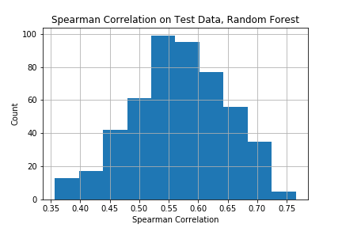

# CS229-TimeSeries-LSTM

## Introduction
In traditional Econometrics, there're various forms of time series models. The calibration methodology and theoretical guarantees of the estimator are usually tailored to each specific model.

With the nascence of NN, it's almost imperative to do a study to see how well a generic LSTM model could fit to time series. In particular, we'd simulate some time series with latent states and see if the cells' contents in fitted LSTM are able to "memorise/match" the latent states in the simulated time series.

## Methodology
* Peepholed-version of LSTM
* SGD with Momentum
* Simulate 5000 uni-variate trajectories for training, 500 for test
* The first 50 steps on each trajectory are for "burn-in"

Step-by-Step:
1. Fit LSTM on simulated training trajectories
2. Extract the cells' contents from the fitted LSTM on training trajectories
3. Regress/classify the ground-truth latent states in the time series against the cells' contents in LSTM -- still on training trajectories
4. Run the regressor/classifier learnt above on the test trajectories (run beforehand the fitted LSTM on the test trajectories to extract the cells' contents) 

## Results
For a Stochastic Volatility process, the Spearman correlation is around 0.55+/-0.2 whether we fit a Linear Regressor or a Random Forest Regressor.

For a Regime-Switching process, the Cross-Entropy is 0.64+/-0.1 for a Logistic Classifier and 1.2+/-0.4 for a Random Forest Classifier.

## Conclusion
There is at best moderate evidence that LSTM truly "understood" and learnt the internal state of the simulated time series.

