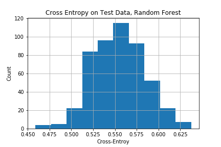

# CS229-TimeSeries-LSTM

## Introduction
In traditional Econometrics, there're various forms of time series models. The calibration methodology and theoretical guarantees of the estimator are usually tailored to each specific model.

With the nascence of NN, it's almost imperative to do a study to see how well a generic LSTM model could fit to time series. In particular, we'd simulate some time series with latent states and see if the cells' contents in fitted LSTM are able to "memorise/match" the latent states in the simulated time series.

## Methodology
* Peepholed-version of LSTM
* SGD with Momentum
* Simulate 5000 uni-variate trajectories for training, 500 for test
* The first 50 steps on each trajectory are for "burn-in"

Step-by-Step:
1. Fit LSTM on simulated training trajectories
2. Extract the cells' contents from the fitted LSTM on training trajectories
3. Regress/classify the ground-truth latent states in the time series against the cells' contents in LSTM -- still on training trajectories
4. Run the regressor/classifier learnt above on the test trajectories (run beforehand the fitted LSTM on the test trajectories to extract the cells' contents) 

## Results
### 50%-Quantile
If we fit against the 50%-quantile loss, for a Stochastic Volatility process, the Spearman correlation is around 0.55+/-0.2 whether we fit a Linear Regressor or a Random Forest Regressor.

For a Regime-Switching process, the Cross-Entropy is 0.64+/-0.1 for a Logistic Classifier and 0.55+/-0.1 for a Random Forest Classifier.

There is barely *moderate* evidence that LSTM truly "understood" and learnt the internal state of the simulated time series.

### Full Quantiles
However if we perform 5 regressions, for 5%-, 25%-, 50%-, 75%-, 95%-quantiles respectively, for the Stochastic Volatility process, the latent state (i.e. the variance) of the time series would be much better learnt if we pool together the cell contents of the 5 fitted LSTMs.

For the regime-switching model, full quantile regressions would still be unable to learn the latent state, possibly due to the fact that fitting high-variance variables takes precedence over low-variance variables in regression. To improve over this, one idea would be to directly feed latent state-relevant information to LSTM. As a simplest and almost silly way to verify this, we feed the ground-truth regime to LSTM for fitting. The cell contents of fitted LSTMs would now be able to learn the regime of the time series.

## Conclusion
To learn the internal state of time series, we would have to model the full distribution of the realisation, and feed information directly relevant to the regime of the series.

